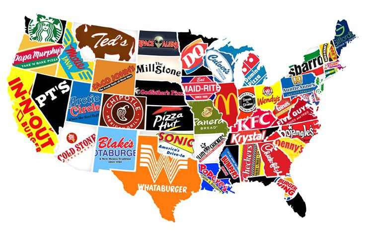

# Web Data Pipeline
Ironhack Madrid Data Bootcamp project nº2




## Overview

The goal of this project was to start with a messy data set of my choice. I needed to import it and build a data pipeline that processes the data and produces a result. 

I started from this data set from Kaggle [American Fast Food restaurants](https://www.kaggle.com/datafiniti/fast-food-restaurants/downloads/fast-food-restaurants.zip/3) which contained representative data of fast food restaurants across the USA, which I populated with data from the APIs of the United States Census Bureau to obtain the [average household income](https://www.census.gov/data/developers/data-sets/Poverty-Statistics.html) and the [total population](https://www.census.gov/data/developers/data-sets/popest-popproj.htmlacross) per state. My hypothesis was that the number of fast food restaurants per capita (per state) must negatively correlated with the average household income.

I also used argparse so that the user provides two arguments (the state and a category of fast food restaurants) and the program generates a report based on the arguments in pdf and sends it by email attachment.

*disclaimer: the CSV dataset is a subset (of 10.000 restaurants and their locations) of the whole dataset which is not available for free


---
## Project phases

### 1 - Cleaning and analysis

Phase where I obtained and prepare the data to be analysed later. 

1. First step was to acquire the data from the dataset CSV and the APIs in the acquisition.py file
2. Clean the data in the clean.py file with the help of the functions in functions_clean.py
3. I analysed the clean data in the analysis.py file to obtain general conclusions: there is in fact a strong negative correlation between the variables


### 2 - Analysis report generation, and pdf email attachment based on arguments

Phase where I analysed the data based on the arguments received in main.py through argparse and generate a report

1. In the functions.py file I further analysed the data based on the arguments received and obtained statistics on the average income, fast food restaurants and state population
2. Generate (based on arguments) in functions.py:
    * A Seaborn plot
    * A PDF report including conclusions and plot
    * An email with the PDF as an attachment sent to the email that the user introduces via input when executing main.py 


## Important notes

To execute the program the user needs to introduce the following two arguments:
- USA State as: --state or -s
- Category of fast food company as: --fastfoodtype or -f


```
# Example
$ python3 main.py -s "California" -f "asian"
```

The accepted categories for the USA state are the following: 
```
['Alabama', 'Alaska', 'Arizona', 'Arkansas', 'California', 'Colorado', 'Connecticut', 'Delaware', 'District of Columbia', 'Florida', 'Georgia', 'Hawaii', 'Idaho', 'Illinois', 'Indiana', 'Iowa', 'Kansas', 'Kentucky', 'Louisiana', 'Maine', 'Maryland', 'Massachusetts', 'Michigan', 'Minnesota', 'Mississippi', 'Missouri', 'Montana', 'Nebraska', 'Nevada', 'New Hampshire', 'New Jersey', 'New Mexico', 'New York', 'North Carolina', 'North Dakota', 'Northern Mariana Islands', 'Ohio', 'Oklahoma', 'Oregon', 'Palau', 'Pennsylvania', 'Puerto Rico', 'Rhode Island', 'South Carolina', 'South Dakota', 'Tennessee', 'Texas', 'Utah', 'Vermont', 'Virgin Islands', 'Virginia', 'Washington', 'West Virginia', 'Wisconsin', 'Wyoming']
```

And this are the accepted categories for the fast food companies:
```
['mexican', 'sandwich', 'italian', 'chicken', 'fish', 'asian', 'burger', 'ice cream', 'mediterranean', 'middle east', 'hot dog', 'american fast food']
```